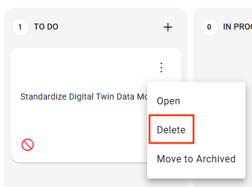

# Task

## Overview

​The task creation interface is organized into multiple tabs, each designed to help you define and manage tasks efficiently.

Below is an overview of the key tabs and their functionalities:



<figure><figcaption></figcaption></figure>

* At the top is the **title** of the Task. (editable)
* **Reporter**: user who created the task (not editable)
* **Organization**: Indicates the organization to which the user who created the task belongs . If the user is associated to only one organization the Organization field is not visible .
* **Priority**: Allows you to set the ticket's priority from the available options.​ (editable)

<figure><figcaption></figcaption></figure>

* **Status** : indicates the current status of the task (not editable)
* **Creation Date** : indicates the date of creation of the Task (not editable)
* **Assegnato to - Team**: Assignment to a team&#x20;
* **Assegnato a utente**: Assignment of the task to a specific user belonging to the team ( if selected) otherwise it is possible to select an organization user



<figure><figcaption></figcaption></figure>

* **Description**: It is possible to enter a technical explanation and define the objectives of the task. Thanks to the text formatting toolbar, the content can be easily customized.

<figure><figcaption></figcaption></figure>

* **Attachments**: Within a task, both the _Reporter_ and the _Assignee_ can attach files such as documents, images, or other useful resources. Attachments are displayed with their file name and can be downloaded by clicking on them.\
  File removal is only allowed for users who have the appropriate permissions.



<figure><figcaption></figcaption></figure>

Collaborative section for leaving textual messages. Through the menu (⋮), a contextual menu opens where it is possible to delete or modify the comment. Please see the [Appendix ](task.md#appendix)for more details.



<figure><figcaption></figcaption></figure>

It is possible to enter a technical solution to resolving the task. Thanks to the text formatting toolbar, the content can be easily customized.

<figure><figcaption></figcaption></figure>



## Creation, Edit and Deletion

Effective task management is crucial for maintaining streamlined and collaborative workflows within the platform. The primary operations available include:​

* [**Creating a Task**: ](task.md#creazione-dei-task)To add a new task, select  the "+" button in the desired section. Enter relevant information such as the title, description, assignee, due date, and priority. Once all details are filled in, save the task to make it visible to all team members.​
* [**Editing a Task**:](task.md#modifica-dei-task) To update an existing task, open it and select the edit option. Make the necessary changes to the available fields and save to update the shared information.​
* [**Deleting a Task**:](task.md#eliminazione-dei-task) To remove a task, access the task's options menu (often represented by three dots or a similar icon) and select "Delete." The system will prompt for confirmation before proceeding with the permanent deletion. Once deleted, the task will be removed from all views and will no longer be accessible.

### **Create Task**

To facilitate agile workflows, a "+" button is available at the top of each column on the task board.

<figure><figcaption></figcaption></figure>

1. It is sufficient to enter only the title of the task (in this case: "Standardize Digital Twin Data Models") and click on Create to generate it.
2. Once created, the task will appear in the column with the other activities.
   * Clicking on the three-dot menu (⋮) opens a contextual menu with three options:
     * **Open**: opens the panel with the task details
     * **Delete**: deletes the task
     * **Move to Archived**: archives the task (without deleting it). Will be present in the folder Archived
3.  Once clicked on **Open**, the detailed panel is accessed, where it is possible to complete the task with all the information:

    * **Organization:** Select the organization to open the task on
    * **Priority**: priority to assign to the task
    * **Due Date**: assign the task’s due date
    * **Assegnato a team**: assign the task to a Team
    * **Assegnato a user** :assign the task to a specific user
    * **Description** : technical explanation and objectives of the task
    * **Attachments**: option to upload files (button "Add attachment")
    * **Comments**: collaborative section for leaving textual messages
    * **Solution**: field to write the proposed solution


**Task Assignment: Users Based on Team or Organization**

When assigning a task to a team and then to a specific user, the users available in the list are those belonging to the team. If no team is selected but a specific user is chosen, the list of users will show those belonging to the organization.


"**Close**" button at the bottom to close the panel.

### Task Editing

To edit the task, click on the three-dot menu (⋮) to open a contextual menu and select "Open." The same action can also be performed by clicking on the task title.

<figure><figcaption></figcaption></figure>

Existing tasks can be updated by the users **directly involved** (Reporter or Assignee).

It is possible to modufy only this fields\

* Title
* Priority
* Description
* Solution
* Due Date


Only the **Reporter** or **Assignee** can make changes.


### **Delete Task**

To **delete** a task, access the three-dot menu (⋮) and select the "Delete" option. Only the **Reporter** or the **Assignee** have the permissions to permanently delete a task. The system will request explicit confirmation before proceeding with deletion.&#x20;

<figure><figcaption></figcaption></figure>


The attachments of the task are deleted together with the task.


## Permissions and Security

n the task management process, editing and deletion operations are reserved exclusively for users who hold an active role in the task, such as the _Reporter_ or the _Assignee_. This approach ensures consistent and responsible control over activities.\
Additionally, all actions performed are recorded in the audit log system (DACXX-1402), guaranteeing full transparency and enabling the monitoring of every operation carried out.\
The following chapters will provide a detailed overview of the rules for editing, assigning, and managing tasks, with a particular focus on security and traceability.

### Permission Map for Task Management

Every action that can be performed on a task—such as commenting, editing, archiving, or deleting—is governed by a permission system that takes into account the user's role and their relationship to the task (e.g., whether they are the assignee, reporter, mentioned, part of a team, or simply an observer).\
The table below provides a detailed summary of the permissions automatically granted based on the type of relationship between the user and the task.

Se il Task ha un assegnatario gli utenti con il ruolo elencato in tabella hanno o meno dei permessi per la gestione deò task. Vediamo nel dettaglio quali sono:

<table data-full-width="true"><thead><tr><th width="111.44439697265625">Ruolo</th><th width="236.8890380859375" align="center">Does the task have an assignee?</th><th width="98" align="center" valign="middle">COMMENT</th><th width="141.3333740234375" align="center">CHANGE STATUS</th><th width="84.666748046875" align="center">ARCHIVE</th><th width="82.4444580078125" align="center">DELETE</th><th width="98.1112060546875" align="center">MODIFY</th><th width="72.4444580078125" align="center">FOLLOW</th></tr></thead><tbody><tr><td><strong>Assignee</strong></td><td align="center">Any</td><td align="center" valign="middle">✅</td><td align="center">✅</td><td align="center">✅</td><td align="center">✅</td><td align="center">✅</td><td align="center">✅</td></tr><tr><td><strong>Reporter</strong></td><td align="center">Any</td><td align="center" valign="middle">✅</td><td align="center">✅</td><td align="center">✅</td><td align="center">✅</td><td align="center">✅</td><td align="center">✅</td></tr><tr><td>
<strong>Users Involved</strong> 

<strong>as Team</strong>
</td><td align="center">Yes</td><td align="center" valign="middle">✅</td><td align="center">✅</td><td align="center">✅</td><td align="center">⛔</td><td align="center">✅</td><td align="center">✅</td></tr><tr><td><strong>Users Involved asTeam</strong></td><td align="center">No</td><td align="center" valign="middle">✅</td><td align="center">✅</td><td align="center">✅</td><td align="center">✅</td><td align="center">✅</td><td align="center">✅</td></tr><tr><td><strong>Users Involved asFollower</strong></td><td align="center">Any</td><td align="center" valign="middle">✅</td><td align="center">⛔</td><td align="center">⛔</td><td align="center">⛔</td><td align="center">⛔</td><td align="center">✅</td></tr><tr><td><strong>Mention</strong></td><td align="center">Any</td><td align="center" valign="middle">⛔</td><td align="center">⛔</td><td align="center">⛔</td><td align="center">⛔</td><td align="center">⛔</td><td align="center">✅</td></tr><tr><td>
<strong>Other</strong>

<strong>(default)</strong>
</td><td align="center">Any</td><td align="center" valign="middle">⛔</td><td align="center">⛔</td><td align="center">⛔</td><td align="center">⛔</td><td align="center">⛔</td><td align="center">⛔</td></tr></tbody></table>

Description of permissions:

* **COMMENT**: ability to add comments to the task.
* **CHANGE STATUS**:possibility to change the status of the task (e.g. from "In progress" to "Completed").
* **ARCHIVE**: possibility of archiving the task.
* **DELETE**: possibility to permanently delete the task.
* **MODIFY**: possibility to modify the main fields of the task (title, description, priority, etc.).
* **FOLLOW**: ability to follow the task and receive notifications on updates.

## &#x20;Tasks archived (DACXX-1201) <mark style="background-color:orange;">WIP</mark>

**An archived task** is an activity that has been completed, suspended, or temporarily removed from the active operational flow, but remains accessible in a dedicated section. Archiving helps keep the interface clean while still allowing access to historical tasks when needed.

Only the **Reporter** or **Assignee** can file a task. The action r**emoves the task from active views** but does not delete it.The task remains accessible in a dedicated sewction **Archivied**, where it can be managed, consulted or restored.

<figure><figcaption></figcaption></figure>

The "**Archived**" section, located in the left-hand toolbar, provides access to all tasks that have been archived.

<figure><figcaption></figcaption></figure>

View all archived tasks they have access to (as reporter, assignee, or team member).

Each task is displayed in the corresponding column based on its current status.

In the Archived board, users can sort tasks by:

* priority
* due date
* creation date.

Each task includes a contextual menu, accessible via the three-dot icon, offering the following options:

* **Open**: View the task details
* **Delete**: Permanently remove the task
* **Move to My Task**: [Unarchive ](task.md#ripristino-unarchive)the task and move it back to the Taskboard

<figure><figcaption></figcaption></figure>

### Unarchive Task

Archived tasks can be reactivated and moved back to the "My Tasks" board. This option is available directly from the task's contextual menu within the archived view. Only authorized users such as the **reporter** or **assignee** are allowed to perform this action.

<figure><figcaption></figcaption></figure>

\---------------------------DOCUMENTATION IN WIP  --------------------------------------

## &#x20;<mark style="background-color:red;">WIP - Follow Task (DACXX-1202) IN DEV</mark>&#x20;

The tasks that a user has decided to follow (e.g. because they are mentioned) are accessible in a dedicated view. This shows:

* Only the tasks followed by the user
* Tasks divided by state
* The ability to add comments

## <mark style="background-color:orange;">WIP - Tasks not valid (DACXX-1203) IN DEV</mark>&#x20;

There is also a section dedicated to **invalidated** tasks, which is useful for monitoring and reviewing. This view helps to keep track of activities that have been excluded from the

## <mark style="background-color:orange;">WIP - Direct access to tasks via email (DACXX-1538) IN DEV</mark>&#x20;

**When a notification is received via email** (e.g., for an update or a mention):

* The email contains a direct link to the task.
* If the user is not logged in, they are redirected to the login page and then to the task.
* If the task has been removed or is no longer visible, a "content not available" message is shown.

### <mark style="background-color:orange;">**WIP - Audit Log –**</mark> <mark style="background-color:orange;"></mark><mark style="background-color:orange;">Tracking of Task Changes</mark> <mark style="background-color:orange;"></mark><mark style="background-color:orange;">**(DACXX- 1402) IN DEV**</mark>&#x20;

The audit log is an automatic record of changes made to tasks. It serves to ensure transparency, accountability and traceability, and is designed to meet the needs of business users who want to keep control over who did what and when.

Information recorded for each change\
Each audit log entry must include:\
👤 Name of the user who made the change (with avatar icon)\
🕒 Date and time (timestamp) of the intervention\
📝 Description of the change made (e.g. "changed the 'Priority' field from 'High' to 'Critical'")\
Changes are grouped by time range to make them easier to read and provide a more readable context Task2204.

\-----------------------------------—  FINISH----------------------------------------------------------------

## Appendix

## Comments and Mentions: Direct Collaboration within the Task

Effective communication is essential to ensure all activities are carried out in a coordinated manner. For this reason, the platform integrates a **comprehensive system of comments and mentions**, allowing users to communicate directly within tasks, swiftly involving the right people or

### Write comments

Each task has a dedicated comment area where involved users can leave notes, updates, or requests.

<figure><figcaption></figcaption></figure>



💡**Who can comment?**

* Assignee
* Reporter
* Members of the team
* Users following the task


Comments are in plain text format, show author and timestamp, and are ordered in reverse chronological order so that the most recent messages (DACXX-1052, DACXX-1249) are displayed first.

### Editing and Delete

<figure><figcaption></figcaption></figure>

To **edit** or **delete** a task, access the three-dot menu (⋮) and select option. Users can only edit their own comments. When a comment is edited, the original creation date is preserved, and the interface displays the timestamp of the last modification (DACXX-1247).\
Users can also delete their own comments. Deletion is permanent, and the content will no longer be visible (DACXX-1248).

## Mention Resources: User, Pages and Reports

&#x20;_(_ (DACXX-977)(DACXX-978)

Within tasks, it is possible to use mentions to create direct links to internal resources on the platform, such as pages or reports. This functionality makes it easier and faster to access relevant content, keeping the work context-rich and easily navigable. The following sections will detail the different types of mentions available and how they work.

### Menzionare Utenti: @username&#x20;

It is possible to involve other users directly in the workflow by writing @username in comments or some fields of the task (such as description or solution).

<figure><figcaption></figcaption></figure>


💡**What happens when someone is mentioned?**

* The user receives an email notification containing:
  * The task name
  * Who mentioned them
  * <mark style="background-color:orange;">Date and time</mark> <mark style="background-color:orange;"></mark>_<mark style="background-color:orange;">(DACXX-1579 – IN DEV)</mark>_
* <mark style="background-color:red;">The email includes a direct link to the task</mark> <mark style="background-color:red;"></mark>_<mark style="background-color:red;">(DACXX-1580)</mark>_<mark style="background-color:red;">.IN DEV</mark>
  * If the user is not logged in, they will be redirected after login.&#x20;
  * If the task has been deleted or invalidated, a message indicating that the content is unavailable will be shown.
* The mentioned person automatically starts following the task _(DACXX-1059)_, and it will appear in their “Followed Tasks” section.



If the mention is **removed** and the user is no longer mentioned elsewhere in the task, he will be automatically disconnected from the task (DACXX-1586). IN DEV


### **Mentioning Pages**&#x20;

In addition to tagging users, the mention system can also be used to reference internal resources, making collaboration and navigation even more efficient. By simply typing "`@ followed by the name of the page`"  followed by the name of a page or report, users can create dynamic links directly within the task description or solution field. This feature not only simplifies access to related content but also helps keep all relevant information connected and within reach.

### Menzione di report&#x20;

The same logic applies to reports. By typing `@report-name`, users can reference a specific report directly within the task. This creates a quick-access link that enhances clarity and context, especially when the task involves data analysis or reporting activities. As with pages, the system ensures that the user has the necessary permissions before allowing access to the mentioned resource.

## Follow/UnFollow a Task <mark style="background-color:orange;">(DACXX-1059) IN DEV</mark>

* When a user follows a task, it is displayed in the **"Follow"** section of the Task Board.
* Once the task is being followed, the user receives **notifications** for every change made to the task.
* It is possible to **stop receiving email notifications** by unfollowing the task.
* The **"Unfollow"** option is available **only from the “Following” view**.
* A task can be followed **only if the user has been mentioned in it**.
